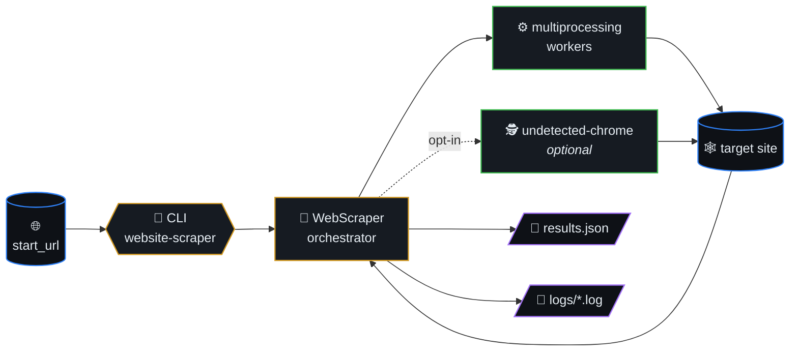
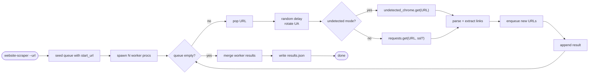
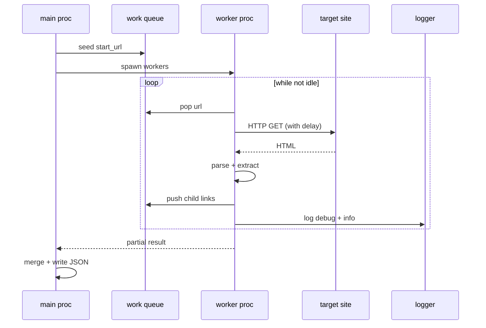
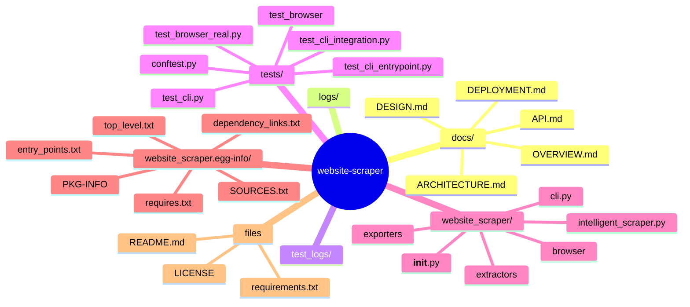

# Website Scraper

> A robust, multiprocessing-enabled web scraper that can be used both as
> a module and as a command-line tool. Features include rate limiting,
> bot detection avoidance, and comprehensive logging.



## Table of contents

- [Features](#features)
- [Scrape algorithm](#scrape-algorithm)
- [Worker sequence](#worker-sequence)
- [Repository layout](#repository-layout)
- [Documentation](#documentation)
- [Installation](#installation)
- [Usage](#usage)
- [Output Format](#output-format)
- [Logging](#logging)
- [Error Handling](#error-handling)
- [Contributing](#contributing)
- [License](#license)
- [🗺️ Repository map](#️-repository-map)

## Scrape algorithm



## Worker sequence



## Features

- Multiprocessing support for faster scraping
- Rate limiting and random delays to avoid detection
- Rotating User-Agents and browser fingerprints
- Comprehensive logging system with separate debug and info logs
- Progress tracking with progress bar
- Both module and CLI interfaces
- JSON output format
- Configurable retry mechanism
- XML content detection and proper handling
- SSL verification options
- Optional **undetected-chromedriver** mode (real Chrome) for heavier bot protection or JavaScript-rendered pages

## Repository layout

| Path | Role |
|------|------|
| `website_scraper/` | Package: `WebScraper`, optional Playwright/LLM stack, CLI |
| `docs/` | Five canonical specs (start at `OVERVIEW.md`) |
| `tests/` | pytest suite |
| `examples/` | Demos (not installed via `pip`) |
| `archive/` | Historical code, not part of the public API |

## Documentation

- **Canonical spec:** five files under [`docs/`](docs/) — start at [`docs/OVERVIEW.md`](docs/OVERVIEW.md).
- **This README:** install, quick start, CLI, undetected Chrome, examples.
- **Releases:** [GitHub releases](https://github.com/ml-lubich/website-scraper/releases).

## Installation

```bash
pip install website-scraper
```

With **undetected-chromedriver** (installs [undetected-chromedriver](https://pypi.org/project/undetected-chromedriver/); you still need [Google Chrome](https://www.google.com/chrome/) installed):

```bash
pip install "website-scraper[undetected]"
```

## Usage

### As a Python Package

Here's a complete example showing how to use the package in your Python code:

```python
from website_scraper import WebScraper
import json

def main():
    # Initialize the scraper
    scraper = WebScraper(
        base_url="https://example.com",  # The website you want to scrape
        delay_range=(2, 5),              # Random delay between requests (in seconds)
        max_retries=3,                   # Number of retries for failed requests
        log_dir="scraper_logs",          # Directory for log files
        max_workers=4,                   # Number of parallel workers (default: CPU count)
        verify_ssl=True                  # Set to False if you have SSL issues
    )

    # Optional: real Chrome via undetected-chromedriver (pip install "website-scraper[undetected]")
    # scraper = WebScraper(
    #     base_url="https://example.com",
    #     log_dir="scraper_logs",
    #     use_undetected_chrome=True,
    #     uc_headless=True,
    # )

    # Start scraping with progress bar
    print("Starting to scrape...")
    data, stats = scraper.scrape(show_progress=True)

    # Print statistics
    print("\nScraping Statistics:")
    print(f"Total pages scraped: {stats['total_pages_scraped']}")
    print(f"Success rate: {stats['success_rate']}")
    print(f"Duration: {stats['duration']}")

    # Save results to a file
    with open("scraping_results.json", "w", encoding="utf-8") as f:
        json.dump(data, f, indent=2, ensure_ascii=False)
    print("\nResults saved to scraping_results.json")

if __name__ == "__main__":
    main()
```

### As a Command-Line Tool

The package installs a `website-scraper` command that can be used directly:

Basic usage:
```bash
website-scraper https://example.com
```

With options:
```bash
website-scraper https://example.com \
    --min-delay 2 \
    --max-delay 5 \
    --retries 3 \
    --workers 4 \
    --log-dir scraper_logs \
    --output results.json
```

Undetected Chrome (after `pip install "website-scraper[undetected]"`):

```bash
website-scraper https://example.com --undetected-chrome -o out.json
# Visible browser window:
website-scraper https://example.com --undetected-chrome --uc-headed -o out.json
```

Available options:
- `-m, --min-delay`: Minimum delay between requests (seconds)
- `-M, --max-delay`: Maximum delay between requests (seconds)
- `-r, --retries`: Maximum retry attempts for failed requests
- `-w, --workers`: Number of worker processes
- `-l, --log-dir`: Directory for log files
- `-o, --output`: Output file path (JSON)
- `-q, --quiet`: Suppress progress bar
- `-k, --no-verify-ssl`: Disable SSL verification
- `--undetected-chrome`: Fetch with undetected-chromedriver (single-process; not compatible with multi-worker pools)
- `--uc-headed`: With `--undetected-chrome`, disable headless mode

## Output Format

The scraper outputs JSON data in the following format:
```json
{
    "data": {
        "url1": {
            "title": "Page Title",
            "text": "Page Content",
            "meta_description": "Meta Description"
        }
        // ... more URLs
    },
    "stats": {
        "total_pages_scraped": 10,
        "total_urls_processed": 12,
        "failed_urls": 2,
        "start_url": "https://example.com",
        "duration": "5 minutes",
        "success_rate": "83.3%",
        "fetch_mode": "requests"
    }
}
```

`stats.fetch_mode` is `"requests"` (default multiprocessing pool) or `"undetected_chrome"` when using `--undetected-chrome` / `use_undetected_chrome=True`.

## Logging

Logs are stored in the specified log directory (default: `logs/`). Two types of log files are generated:
- `[timestamp].log`: Contains INFO level and above messages
- `debug_[timestamp].log`: Contains detailed DEBUG level messages

The logs include:
- Request attempts and responses
- Pages being processed
- Successful scrapes
- Failed attempts
- Progress updates
- Error messages
- Content type detection
- Parser selection

## Error Handling

- Automatic retry mechanism for failed requests
- Graceful handling of SSL certificate issues
- Proper handling of XML vs HTML content
- Rate limiting and timeout handling
- Comprehensive error logging
- All errors are logged but don't stop the scraping process

## Contributing

Contributions are welcome! Please feel free to submit a Pull Request.

## License

This project is licensed under the MIT License - see the LICENSE file for details.


## 🗺️ Repository map

Top-level layout of `website-scraper` rendered as a Mermaid mindmap (auto-generated from the on-disk tree).


